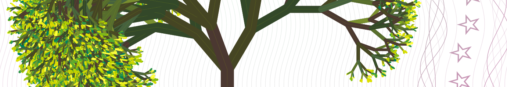

# Tree Coin Whitepaper

The Tree Coin® is an alternative solidarity model linked to an electronic symbol, the Tree Coin Logo, as academic Non-Financial, Non-Monetary, Non-Currency solidarity experiment.  It's a non-exchangeable electronic instrument, deemed to facilitate ethical approvisionnement of basic goods trough ethical barter.  It's a solidarity symbol, based on CREDIT, on sustainability, on mutual trust, respect for others and Mother Nature.

* The Tree Coin is not a money
* The Tree Coin is a symbol to facilitate barter
* The Tree Coin is an ecological concept

 

With the Tree Coin® you can generate your \[ethical-artistic-note] by yourself and share it with your circles as alternative collaborative instrument.

The Tree Coin® follow lunar phases and regenerates the minimum amount 1000 TREE every lunar cycle (28 days), as the plants regenerates itself in Mother Nature.  You cannot never own less than zero, and it's specifically designed for emerging realities such as eco-villages and rural areas.

The Tree Coin® project allow anyone attaining the goal of protecting land and trees, as well as to establish eco-villages, relying on the concept of Sustainable Development and Climate Change reduction and better life conditions, in attainment of the United Nations Sustainable Development Goals (SDGs), promulgated by the United Nations General Assembly on 25 September 2015.

---

## Participation to the UN Global goals

The Tree Coin® project works in attainment of the United Nations Sustainable Development Goals (SDGs) on three main following UN Global Goals:

- Reforestation, and Life on Earth ([SDG 15](https://en.wikipedia.org/wiki/Sustainable_Development_Goal_15))
- Reduction of CO₂ and Climate Change ([SDG 13](https://en.wikipedia.org/wiki/Sustainable_Development_Goal_13))
- Post Pandemic Recovery and General well-being ([SDG 3](https://en.wikipedia.org/wiki/Sustainable_Development_Goal_3))

 

→ [Read about our participation to UN Global Goals](https://whitepaper.treecoin.online//un-sustainable-development/participation-to-un-global-goals/)
