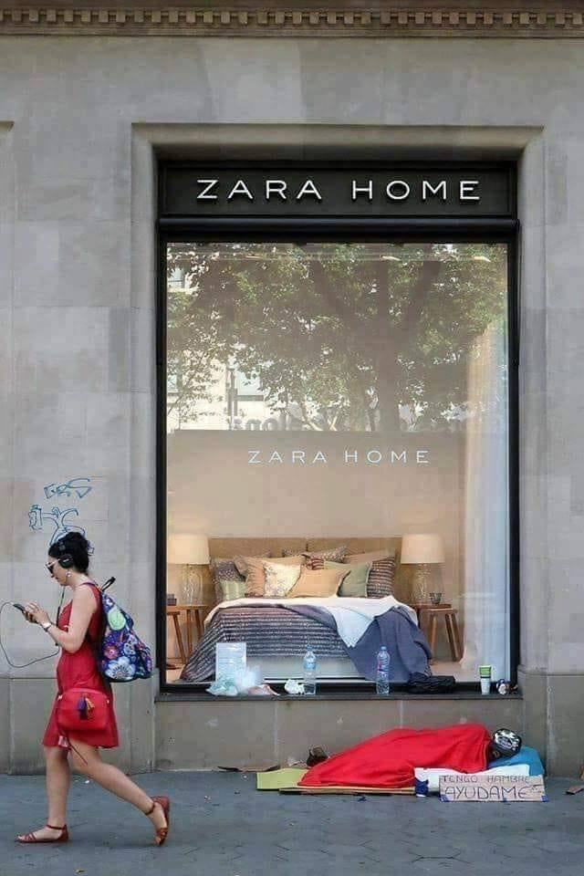
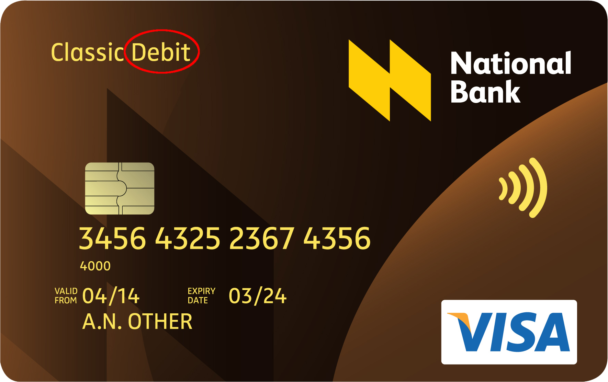

# Il problema del Debito

**Tutti i problemi odierni sono dovuti principalmente al paradigma del DEBITO, che è un valore basato su una scala negativa.** 
In natura i valori negativi non esistono, o per lo meno sono ugali a zero. 
Non puoi possedere `-1` pietre, legna o mele fisiche, e il concetto di *moneta* non è un prodotto della natura, qualcosa che cresce sugli alberi e che può essere raccolto.

La scala negativa non è correlata a cose reali ma è una pura rappresentazione economica concettuale: sarà stata utile per stimolare il mondo dal dopoguerra ad oggi, ma oggi viene usata dai privati per spingere le società *oltre* le dittature totalitarie e/o le manipolazioni di massa. 
<figure style="float: right; margin: 0; padding-left: 1em; width: 400px;">
  
   
  <figcaption style="margin: 1em 0 1em 1em;">
    Una testimonianza della nostra società "perfetta" (basata sulla scarsità). 
    Questo avviene ORA, proprio sotto la tua casa...
  </figcaption>
</figure>

L'impiego di metriche negative equivale al *rimuovere costantemente* e quindi durante i tempi il benessere è diminuito, diminuito, diminuito... Oggi ognuno di noi può vederne gli effetti e questo è semplicemente inutile ma anzi totalmente opposto alla via del benessere comune. 

Le scale negative ci hanno mangiato il cervello, ci hanno messo l'uno contro l'altro e hanno concentrato tutta l'attenzione comune sul principio della scarsità: oggi essere ricchi significa che qualcun altro è povero. 
Un'economia basata sulla scala negativa significa avere senzatetto ma case vuote, conducenti senza veicoli ma showroom pieni di nuove auto fiammeggianti, parcheggiate in esposizione... scarsità da un lato e rifiuti dall'altro!

Quasi tutti i paesi del mondo utilizzano un sistema monetario che genera scarsità e concorrenza. 
Possiamo vedere questo dramma incontenibile (la nostra *falsa-abbondanza*) diffuso in tutti i segmenti della società e, in generale, esteso in tutto il mondo. 
Tutta la politica, le restrizioni, le guerre e i singoli problemi personali sono legati a questa domanda: *dove andrà a finire il segno negativo?* 

 
 

!!! tip
    I valori sono costituiti da un mutuo accordo sulla stima per qualcosa di equivalente, qualunque esso sia. 
    Ma stiamo ancora utilizzando un sistema monetario che genera scarsità e concorrenza.
 

> <small>*Un ostacolo ancora più profondo all'esame del nostro sistema monetario risiede nei recessi della nostra collettività: <b>siamo motivati sia dalla paura della scarsità che dall'avidità.</b> 
> La paura della scarsità spesso porta con sé la tendenza a evitare di affrontare la realtà delle nostre finanze e l'avidità porta ad un'attenzione ossessiva sul denaro. 
> Il conflitto tra queste due forze porta a uno stato di approccio-allontanamento in relazione al denaro - una lotta interiore che esacerba ulteriormente la complessità dell'indagine.. 
> Il denaro stesso diventa altamente emotivamente carico.*
>
> [...]
>
> *Il denaro è semplicemente un costrutto umano, come verrà mostrato, progettato in e per un'altra epoca. 
> Comprendendo come funzionano davvero i soldi, stiamo creando un sistema diverso che supporta il tipo di società che desideriamo per noi stessi e per le generazioni future. Si tratta di come trasformare in realtà un futuro sostenibile e abbondante.* (Ibid.) </small>
>
> <small>[ *Rethinking money - How new currencies turn scarcity into prosperity* - Bernard Lietaer, Jacqui Dunne - Berrett-Koehler Publishers ]</small></small>

 

Il saccheggio delle risorse naturali quotidiane ha creato un falso senso di progresso basato sul fatto che la scarsità non è qui, ma che è stata semplicemente spostata da un luogo all'altro (in generale le colonie imperiali del passato - oggi 3° e 4° mondo), quindi oggi noi abbiamo un altro grosso problema: stiamo usando troppo quel vecchio sistema e non ci sono altri posti che sostengono quel paradigma. 
Abbiamo almeno `-2` pianeti! 
Ecco perché ogni anno la [Earth Overshoot Day](https://it.wikipedia.org/wiki/Earth_Overshoot_Day) si anticipa sempre di più...

Questo concetto è ben raffigurato dalla teoria del "*criceto impossibile"*...

<iframe width="100%" height="350" src="https://www.youtube.com/embed/bqz3R1NpXzM" title="Il criceto impossibile (e la crescita economica)" frameborder="0" allow="accelerometer; autoplay; clipboard-write; encrypted-media; gyroscope; picture-in-picture" allowfullscreen></iframe>

### Come i fantasmi hanno spinto l'umanità ad uccidere sè stessa
Come possiamo vedere, l'attuale paradigma si basa su un vecchio sistema monetario basato sul debito e su interessi composti inesistenti, quindi la crescita esponenziale nel lungo periodo è fallita, perché la *crescita infinita* è matematicamente impossibile in un mondo *finito*. 
L'applicazione di un *interesse composito* (pagamento di interessi su interessi) obbliga tutti noi a trovare denaro aggiuntivo per coprire il primo, quindi alla fine non solo *tutto* è ora posseduto da un piccolo gruppo bancario - che è un *fantasma legale comunemente accettato come "persona"* - ma **siamo tutti spinti ad abusare e truffarci a vicenda, mossi dalla scarsità di... numeri sugli schermi!** 
I fantasmi ci hanno spinto a combattere, uccidere e ad essere davvero pericolosi per noi stessi in nome della falsa abbondanza. 
Questo processo è ancora in corso... 

<figure style="float: right; margin: 0 0 1em 0; padding-left: 1em; width: 400px;">
  
   
  <figcaption style="margin: 1em 0 1em 1em;">
    Esempio di una carta a Debito che hai già nel tuo portafoglio. 
    Puoi vedere sempre il testo "Debit" come dichiarazione dell'attuale paradigma economico
  </figcaption>
</figure>
Puoi vedere la prova dell'attuale paradigma del debito sempre scritta su tutte le carte bancomat. Apri il tuo portafoglio e controlla ora! 
Questo non significa - come vogliono farci pensare - che "*i soldi vengono spostati direttamente dal tuo conto"* perché in tal caso dovrebbe dire "*trasferimento diretto*", oppure "*diretto*" o "*a revisione*"... 
Invece, quando vedi scritto "credito", significa che "*la banca ti permette di spendere un po' fino ad un certo massimo, e per questo servizio devi pagare un supplemento, e sei anche soggetto a revisione fiscale* "... è comunque debito inesigibile e non un vero credito!

---

## Alcuni rapporti ufficiali su quanto illustrato

!!! warning "[Oxfam, Time to care, 2020 Report](https://www.oxfam.org/en/research/time-care) La scala del divario tra ricchi e poveri oggi"
    Il divario tra i super ricchi e il resto della società rimane inimmaginabilmente enorme.

    * Nel 2019 i miliardari del mondo, solo 2.153 persone, hanno più ricchezza di 4,6 miliardi di persone.
    * I 22 uomini più ricchi hanno più ricchezza di tutte le donne in Africa.
    * L'1% più ricco del mondo ha più del doppio della ricchezza di 6,9 miliardi di persone.
    * Se risparmiassimo 10.000$ al giorno dalla costruzione delle piramidi in Egitto ad oggi avremmo un quinto della fortuna media dei 5 miliardari più ricchi.
    * Se tutti dovessero sedersi sulla loro ricchezza accumulata in banconote da $ 100, la maggior parte dell'umanità sarebbe seduta per terra. Una persona della classe media in un paese ricco sarebbe seduta all'altezza di una sedia. I due uomini più ricchi del mondo sarebbero seduti nello spazio.
    * Il valore monetario del lavoro di cura delle donne non retribuito a livello globale, per le donne di età pari o superiore a 15 anni, è di almeno 10,8 trilioni di dollari all'anno, tre volte più grande dell'industria tecnologica mondiale.
    * Tassare un ulteriore 0,5% della ricchezza dell'1% più ricco del mondo, per i prossimi 10 anni, equivale agli investimenti necessari per creare 117 milioni di posti di lavoro nei settori dell'istruzione, della salute e dell'assistenza agli anziani, e in altri settori e per colmare i deficit assistenziali.

!!! warning "[UNCTAD, World Investment Report 2019](https://unctad.org/webflyer/world-investment-report-2019)"
    *Il commercio di libero scambio concentra in media sull'1% delle imprese di ogni paese il 57% della produzione export*

!!! tip "Guarda anche il [Global Footprint Network](https://www.footprintnetwork.org/) per le statistiche in tempo-reale"

---

## Altro materiale ispiratore
Per una migliore comprensione si consiglia la visione del documentario "Sulla Servitù Moderna":

<iframe src="https://player.vimeo.com/video/86653115?h=9a296d5af2" width="100%" height="350" frameborder="0" allow="autoplay; fullscreen; picture-in-picture" allowfullscreen></iframe>
