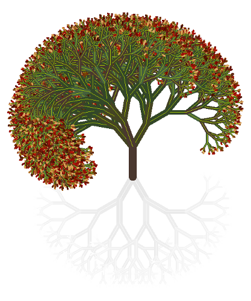
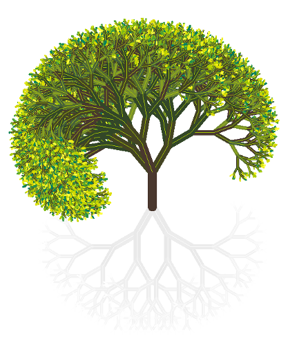

# Il logo dei Tree Coin

Il logo Tree Coin è disegnato da uno <a target="_blank" href="https://github.com/Tree-Coin/Logo">script totalmente automatizzato basato su semplici algoritmi</a>, che cambia la composizione dell'albero e il colore della sua chioma in ogni stagione: brillante in Primavera ed Estate, brunastra in autunno, bianca in inverno... come un albero vivo!!!

Arricchisce il valore simbolico degli stessi Tree Coin sottolineando il valore reale della vita degli alberi per l'intero Pianeta.

**Loghi di esempio**:
<table style="width: 100%; border: 0px none !important; pointer-events: none;">
  <tr>
    <td align="center">
       Autunno
    </td>
    <td align="center">
       Inverno
    </td>
    <td align="center">
       Primavera
    </td>
    <td align="center">
       Estate
    </td>
  </tr>
</table>

 

[ :material-book-outline: Vedi i dettagli tecnici del disegno](../technical-plotting-details/){ .md-button }
