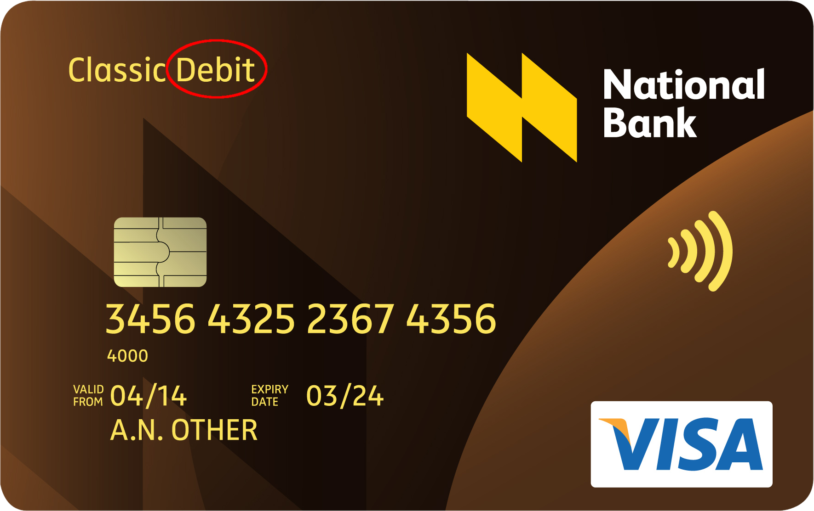

# The Debit Problem

**All the problems today are due to to a DEBIT paradigm, which is a value based on a negative scale**: in nature negative values does not really exists, or at least it’s equal to zero.

Physically you cannot own `-1` stones, woods or apples, it’s a serious contradiction minded from an ill reasoning and carried on day by day by custom: since millennia ago this led all the problems moved every time to next generations and give us today having at least `-2` planets!
That’s why every year the [Earth Overshoot Day](https://en.wikipedia.org/wiki/Earth_Overshoot_Day) is anticipated more and more...

This is well drawn by the "*impossible hamster"* theory...

<iframe width="100%" height="350" src="https://www.youtube.com/embed/bqz3R1NpXzM" title="The impossible Hamster (and economic growth)" frameborder="0" allow="accelerometer; autoplay; clipboard-write; encrypted-media; gyroscope; picture-in-picture" allowfullscreen></iframe>

The current paradigm is ever based on **Debit** and you can see it ever written on all bancomat card.

This not means - as they wants you think - that "*money are directly moved from your account"* because if so it should say "*direct transfer*", or "*direct*" or - otherwise - "*to revision*".

Instead, when you see wrote "credit", this means that "*the bank allow you to spend a bit until a certain maximum, and you have to pay an extra fee for this service, and you are subject to a fiscal revision*"… that’s a bad debit anyway and not a real credit!

 Sample of a Debit card you already have in your wallet. You can see the text "Debit" as declaration of the current economic paradigm

 

## The solution

In a world based a **negative scale**, all resources are made by plunder the nature.
In the same time we assist to an irreparable negative trend of all economies of the world, because all economies are based on the same paradigm: **recursive debit and resource depredation**.

**This is not we want anymore, so the key is pretty simple: let's do the exact opposite!**

### Credit and tree protection together
We thought of a **totally opposite economic system**, therefore parallel and independent from the current one, supported by the principle of cryptocurrencies but independent from all global FIAT currencies and easy scalable between current crypto chains: the **Tree Coin®**.

The **Tree Coin**®, with its free ecological sustainability aims to become the concrete ecological platform for linking sustainable development, providing effective supply at the service of ecological benefits, protecting healthy tree from burning, is therefore the key for allow cross-pollinators (insects) being harboured in freshness and from their nets pollinate the various flowers and agricultural crops.
Bees need trees: and we all know the Einstein’s Say: "4 years after the bees collapse, mankind will be over".

The **Tree Coin®** value is based on consensus on fair and ethical ecological benefit of Biological produce and Living Trees, unlike other currencies which are based on gold or pure speculation.
The reason is simple: a planet without trees is no living planet!
Therefore the **Tree Coin®** is a true **hymn to life**: it may sustain ecosystem benefits of trees and related forestry wildlife and CO₂ reduction to sustain the world population.
In fact, in less than 30 years, at a rate of increase is estimated at **81 million people per year the** world will count on a population of [about 8 billions of humans](https://www.worldometers.info/world-population/) of which **851,331,777 undernourished** according to the [State of world food insecurity by FAO](https://www.fao.org/publications/sofi/en/).

 

# Financing Eco-villages
We do not produce *shitcoins* and we do not want to steal money to no one, so we do not ask to buy or exchange money for our crypto.
If you want you can <a href="https://www.paypal.com/donate/?hosted_button_id=A7YZNW8QTPYVC" target="_blank">support our project</a> but is totally different from selling or exchange virtual bits...

Eco-villages are the future of new sustainable economy and societal aggregation and therefore the **Tree Coin®** is also perfect for funding the establishment, keeping and growth of Eco-villages and for the sustaining of their circular economy: they may be exchanged to buy goods and exchange services and reward volunteering work for environmental protection as well as for guaranteeing long term social welfare, and therefore allowing overall economical and ecological sustainable development from local to global scale, as also foreseen by Multilateral Agencies, Nongovernmental Organizations and CBOs (Community Based Organizations), always in ethical, consensual, non monetary (debt) way.

## Tree Coin® in a nutshell
The **Tree Coin® (TREE)** is an ECOLOGICAL and completely ethical CREDIT and therefore, in the legal and fiscal terms, **does not belong to the standard FIAT currencies and not-directly to other cryptocurrencies** for the following reasons:

!!! info
    1. The **Tree Coin® (TREE)** has undetermined value and is granted for free or by free offer;
    2. It's a circular economy based on CREDIT, thought to be spread through Associations, neighbour groups and ecovillages;
    3. Its value DOES NOT correspond to any FIAT currency or to other cryptocurrencies because is exclusively based on the consensus between humans, in order to favourite the exchange of real economy goods;
    4. It is a **barter facilitator**, a third numerical parameter NOT a Currency: you cannot exchange or buy the CREDIT by itself, but you can use it for make donations or do comparisons;
    5. The credit granting paradigm means **giving before asking for a service** and not paying after it is done. So if you entitle someone the task to do something for you, you are granting trust and energy for a certain period of time.
    You give credit for something after which you can confirm it, renew or revoke... STOP SCAMS!
    6. **Credits are linked to moon and solar phases**, as each goods of our Mother Earth;
    7. Is **a real circular economy** and you can't ever go down less zero: it represents "how much we can do", so the total amount is algorithmically designed to renew itself periodically. This means that you can spend all that you have and see your credit periodically resetted to the initial amount, because you are a human being and so until you are not able, you cannot lose the will to do stuff!
    8. **You can print paper-credits by yourself!** Really, as example you can generate and print your custom check-notes of 17,88 Tree Credits and/or different amounts… What's really important is the generated hash (token) linked to the chain and finally printed by you.
    Once a paper-credit is generated, a generic trust is created, and it’s free to circulate hand-by-hand until someone claim it back to its own digital account, after that the serial is marked as **ALREADY USED** or **EXPIRED**.
    9. Any credit note has its own generated tree depicted, so what you generate can become an NFT, which is a potential infinite credit... 
    > **NOTE**: If you have a laser printer, you can have fun by creating your sustainable wood-credit-note or “a real leaf-note”, you can paint a picture with enriched credit value (the token) or knit a dress with a valid credit token… As with nature products, there’s no limit of what you can do... 
    We will provide all the needed software to do it.
    10.	Open Source System: both graphics and codes are released as Open Source softwares and creations!
