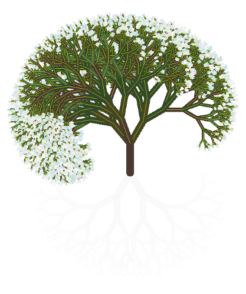

# The Tree Coin® logo

The Tree Coin® logo is designed by a <a target="_blank" href="https://github.com/Tree-Coin/Logo">totally automated script based on algorithms</a>, which changes the tree composition and its crown colour at every season: brilliant in Spring and Summer, brownish in Autumn and Winter... like a living tree!!!

It enriches the symbolic value of the Tree Coin® itself by underlying the real value of tree life for the entire Planet.

**Sample logos**:
<table style="width: 100%; border: 0px none !important; pointer-events: none;">
  <tr>
    <td align="center">
       Autumn
    </td>
    <td align="center">
       Winter
    </td>
    <td align="center">
       Spring
    </td>
    <td align="center">
       Summer
    </td>
  </tr>
</table>

---
